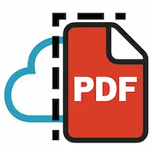

# NoCloudPDF



**クラウドにアップロードしない、ブラウザ完結型のPDF操作ツール**

NoCloudPDFは、プライバシーを重視したブラウザベースのPDF操作アプリケーションです。すべての処理がクライアント側で実行されるため、ファイルがサーバーにアップロードされることはありません。

## 🌟 主な機能

### 📄 PDF分割（Split）
- PDFファイルをページ単位で分割
- ページ表示とファイル表示の切り替え可能
- 複数ページの一括選択・分割
- パスワード保護PDFに対応

### 🔗 PDF結合（Merge）
- 複数のPDFファイルを1つに結合
- ドラッグ&ドロップによる直感的な操作
- ページ順序の自由な並び替え
- 画像ファイル（JPG、PNG等）も結合可能

### 🔒 セキュリティ
- すべての処理がクライアント側で完結
- ファイルがサーバーにアップロードされない
- パスワード保護PDFの処理に対応

## 🚀 技術スタック

- **Frontend**: Blazor WebAssembly
- **UI Framework**: Tailwind CSS
- **PDF処理**: PDF.js
- **Icons**: Font Awesome
- **Language**: C# (.NET 8)

## 🖥️ 対応環境

- **ブラウザ**: Chrome, Firefox, Safari, Edge (最新版)
- **デバイス**: デスクトップ、タブレット、スマートフォン
- **OS**: Windows, macOS, Linux, iOS, Android

## 📦 インストール・実行

### 前提条件
- .NET 8 SDK
- Node.js (Tailwind CSS用)

### ローカル実行
```bash
# リポジトリをクローン
git clone https://github.com/Guri-hm/NoCloudPdfApp.git
cd NoCloudPdfApp

# 依存関係をインストール
dotnet restore

# 開発サーバーを起動
dotnet run
```

### ビルド
```bash
# 本番用ビルド
dotnet publish -c Release -o ./publish
```

## 🎯 使い方

### PDF分割
1. 「分割」ページにアクセス
2. PDFファイルをドラッグ&ドロップまたは選択
3. 分割したいページを選択
4. 「選択したページを分割」をクリック

### PDF結合
1. 「結合」ページにアクセス
2. 結合したいPDFファイルを追加
3. ページ順序を調整（必要に応じて）
4. 「結合」ボタンをクリック

## 🔧 プロジェクト構造

```
NoCloudPdfApp/
├── Components/          # 共通コンポーネント
│   ├── DropCover.razor
│   ├── FadeInOnScroll.razor
│   └── PasswordInputDialog.razor
├── Models/              # データモデル
│   ├── DisplayItem.cs
│   ├── FileMetadata.cs
│   └── PageItem.cs
├── Pages/               # ページコンポーネント
│   ├── Home.razor
│   ├── Split.razor
│   └── Merge.razor
├── Services/            # ビジネスロジック
│   ├── PdfDataService.cs
│   └── CompletionStateService.cs
└── wwwroot/            # 静的ファイル
    ├── css/
    ├── js/
    └── img/
```

## 🌐 デモ

[ライブデモを試す](https://your-github-pages-url.github.io/NoCloudPdfApp)

## 📝 ライセンス

このプロジェクトは [MIT License](LICENSE) の下で公開されています。

## 🤝 コントリビューション

プルリクエストやイシューの報告を歓迎します！

1. このリポジトリをフォーク
2. 機能ブランチを作成 (`git checkout -b feature/amazing-feature`)
3. 変更をコミット (`git commit -m 'Add some amazing feature'`)
4. ブランチにプッシュ (`git push origin feature/amazing-feature`)
5. プルリクエストを作成

## 🐛 バグ報告・機能要望

バグ報告や機能要望は [Issues](https://github.com/Guri-hm/NoCloudPdfApp/issues) にてお知らせください。

## 📧 連絡先

- GitHub: [@Guri-hm](https://github.com/Guri-hm)
- プロジェクト: [NoCloudPdfApp](https://github.com/Guri-hm/NoCloudPdfApp)

---

⭐ このプロジェクトが役に立った場合は、スターをつけていただけると嬉しいです！
